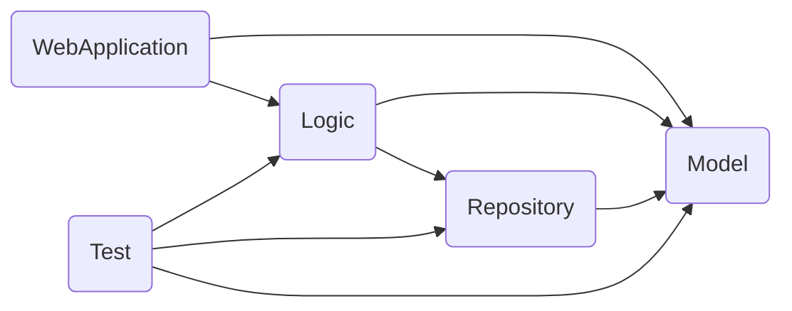

### 專案類型
- Web API 服務

### 主要框架
- .NET 8.0

### 第三方套件列表
||Package|
|--|--|
|Data Access|Dapper Microsoft.Data.Sqlite|
|IoC|Ninject|
|Unit Test|NUnit NSubstitute|
|Telemetry|Application Insights|

### 資料庫
- Sqlite
- 資料表擷取自 **[Northwind].[Customers]** 為範例

### 開發工具
- Visual Studio 2022 Community

### 專案相依性
